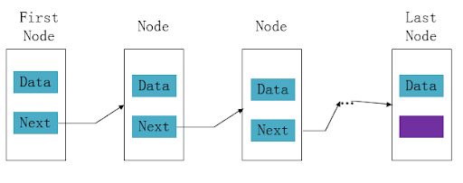

# 数据结构中的线性离散存储-链表

> 在上节，我们已经了解到了线性存储中的连续存储，我们还把这种存储结构叫做顺序表，或者数组。并且知道线性连续存储存在以下优缺点：

- 优点：能实现快速追加和存取元素
- 缺点：插入元素或删除元素都要移动大量的原有元素

在本节，我们将一起来了解《数据结构》中研究的另一种线性数据结构-离散存储，我们也可以把线性的离散存储叫做链表。链表的基本结构如下图：


如果你没有阅读过本系列的前面部门文章，建议您通过以下链接先阅读之前的内容：

- **1.从线性连续存储开始，重新认识《数据结构》 [https://blog.jkdev.cn/index.php/archives/327/](https://blog.jkdev.cn/index.php/archives/327/)**

## 一、链表的实现过程

### 1.定义链表节点

> 和顺序表相比，链表的存储结构在实现插入、删除时，不需要移动大量的元素。但不容易实现随机存取元素线性表中第 i 个元素的操作。所以链表适用于需要经常进行插入和删除的操作的线性表，如飞机航班乘客表。

首先我们定义一个`02-LinkList.cpp`文件，需要引入基本的 c 语言头文件，并且定义链表节点的结构体

```cpp
# include <stdio.h> // 标准io头部，包含printf函数
# include <malloc.h> // 包含malloc函数，在mac电脑上，改为sys/malloc.h
# include <stdlib.h> // 包含exit函数

typedef struct Node
{
    int data;           // 数据域
    struct Node *pNext; // 指针域
} NODE, *PNODE;         // NODE 等价于 struct Node, *PNODE 等价于* Node
```

### 2.创建链表

接下来我们定义创建链表的函数

```cpp
PNODE create_list(void)
{
    int len; // 存放节点的有效个数
    int val; //存放用户输入的临时存入的节点的值

    // 分配一个不存在任何数据的头节点
    PNODE pHead = (PNODE)malloc(sizeof(NODE));
    if (NULL == pHead)
    {
        printf("内存分配失败!\n");
        exit(-1);
    }

    // 初始状态下，链表尾节点和头节点指向同一个内存（即头节点就是尾节点），而指针域为NULL
    PNODE pTail = pHead;
    pTail->pNext = NULL;

    printf("请输入您需要生成的链表节点的个数：len=");
    scanf("%d", &len);

    for (int i = 0; i < len; i++)
    {
        printf("请输入第%d个节点的值", i + 1);
        scanf("%d", &val);

        PNODE pNew = (PNODE)malloc(sizeof(NODE));
        if (NULL == pNew)
        {
            printf("分配失败，程序终止！\n");
            exit(-1);
        }

        // 分配成功，给新节点赋值
        pNew->data = val;
        // 让链表尾节指针域点指向最新的节点，实现增加新节点
        pTail->pNext = pNew;
        // 新节点的指针域为NULL
        pNew->pNext = NULL;

        // 最后，再让尾节点指向新节点。
        pTail = pNew;
    }

    // 链表创建完成后，返回头节点
    return pHead;
}
```

### 3.遍历链表元素

从头节点开始，如果链表节点的指针域不为 NULL，即输出数据

```cpp
void traverse_list(PNODE pHead)
{
    // 把第一个节点赋给变量p
    PNODE p = pHead->pNext;

    while (NULL != p)
    {
        // p 不为NULL,代表有数据，则输出p的数据于
        printf("%d  ", p->data);
        // 输出p的数据域之后，让p指向下一个节点
        p = p->pNext;
    }
    printf("\n");
    return;
}
```

### 4.判断链表是否为空和计算链表长度

如果链表头节点的指针域为空，则链表是空链表。长度的计算则通过遍历链表来计算，如下代码

```c
// 判断链表是否为空
bool is_empty(PNODE pHead)
{
    if (NULL == pHead->pNext)
    {
        return true;
    }
    else
    {
        return false;
    }
}

// 计算链表的长度
int length_list(PNODE pHead)
{
    PNODE p = pHead->pNext;
    int len = 0;
    while (NULL != 0)
    {
        ++len;
        p = p->pNext;
    }
    return len;
}
```

### 5.链表排序

接下来，我们根据从小到大的数据域值对链表节点进行排序。链表的排序和顺序表类似，我们使用两个节点变量用于临时存储对比中的两个节点，如下代码

```c
// 链表排序
void sort_list(PNODE pHead)
{
    int i, j, t;
    int len = length_list(pHead);
    // 定义p和q两个节点变量，用于临时存放交换节点
    PNODE p, q;

    // 让p指向当前节点
    for (i = 0, p = pHead->pNext; i < len; i++, p = p->pNext)
    {
        // 让q指向下一个节点
        for (j = i + 1, q = p->pNext; i < len; j++, q = q->pNext)
        {
            // 用当前节点和下一个节点进行对比，如果当前节点的数据域大于下一个节点，就将数据进行交换
            if (p->data > q->data)
            {
                t = p->data;
                p->data = q->data;
                q->data = t;
            }
        }
    }
}
```

### 6.插入新节点

在接下来的插入和删除操作中，我们记链表的索引为 position，position 从 0 开始。首先，在链表的 position 位置插入节点，该节点的值是 val，代码如下

```c
// 插入节点
bool insert_list(PNODE pHead, int position, int val)
{
    int len = length_list(pHead);
    if (len < 0 || position > len)
    {
        return false;
    }

    int i = 0;
    PNODE p = pHead;
    // 使用while循环，使p变量指向position节点的前一个节点
    while (NULL != p->pNext && i < position)
    {
        p = p->pNext;
        ++i;
    }

    // 程序执行到这里，p已经指向position节点的前一个节点，position节点是否为空无所谓

    // 插入过程1：分配新节点
    PNODE pNew = (PNODE)malloc(sizeof(NODE));
    if (NULL == pNew)
    {
        printf("动态分配内存失败失败");
        exit(-1);
    }
    // 插入过程2：将传入的值赋给新节点的数据域
    pNew->data = val;

    // 插入过程3：用变量q临时存储position节点
    PNODE q = p->pNext;
    // 插入过程4：将position节点的前一个节点指向新节点
    p->pNext = pNew;
    // 插入过程5：再将新节点指向posion节点
    pNew->pNext = q;

    return true;
}
```

### 7.删除节点

删除节点和插入节点操作类似。区别在于，插入节操作在找到 position 节点后，动态分配新空间并插入到原链表的 position 位置，删除节点操作则在找到 position 节点之后，释放 position 节点的空间，再把原 position 旁边两个不相连的节点连接起来。

```c
// 删除节点
bool delete_list(PNODE pHead, int position, int *pVal)
{
    int len = length_list(pHead);
    if (len < 0 || position > len)
    {
        return false;
    }

    int i = 0;
    PNODE p = pHead;

    // 使用while循环，使p变量指向position节点的前一个节点
    while (NULL != p->pNext && i < position)
    {
        p = p->pNext;
        ++i;
    }

    // 如果position节点为NULL，返回false
    if (NULL == p->pNext)
    {
        return false;
    }

    // 程序执行到这里，p已经指向position节点的前一个节点，并且position节点是存在的
    // 删除过程1，让q变量指向position节点
    PNODE q = p->pNext;
    // 删除过程2，将position节点的数据赋给pVal
    *pVal = q->data;

    // 删除过程3，让position节点的前一个节点指向position节点的下一个
    p->pNext = p->pNext->pNext;

    // 删除过程4，释放position节点指向的内存，并让q变量指向NULL
    free(q);
    q = NULL;

    return true;
}
```

## 二、测试与验证

### 1.测试

所有测试代码如下

```c
#include <stdio.h>
#include <sys/malloc.h>
#include <stdlib.h>

// 定义链表节点
typedef struct Node
{
    int data;           // 数据域
    struct Node *pNext; // 指针域
} NODE, *PNODE;         // NODE 等价于 struct Node, *PNODE 等价于* Node

// 创建一个非循环的单链表
PNODE create_list(void)
{
    int len; // 存放节点的有效个数
    int val; //存放用户输入的临时存入的节点的值

    // 分配一个不存在任何数据的头节点
    PNODE pHead = (PNODE)malloc(sizeof(NODE));
    if (NULL == pHead)
    {
        printf("内存分配失败!\n");
        exit(-1);
    }

    // 初始状态下，链表尾节点和头节点指向同一个内存（即头节点就是尾节点），而指针域为NULL
    PNODE pTail = pHead;
    pTail->pNext = NULL;

    printf("请输入您需要生成的链表节点的个数：len=");
    scanf("%d", &len);

    for (int i = 0; i < len; i++)
    {
        printf("请输入第%d个节点的值:", i + 1);
        scanf("%d", &val);

        PNODE pNew = (PNODE)malloc(sizeof(NODE));
        if (NULL == pNew)
        {
            printf("分配失败，程序终止！\n");
            exit(-1);
        }

        // 分配成功，给新节点赋值
        pNew->data = val;
        // 让链表尾节指针域点指向最新的节点，实现增加新节点
        pTail->pNext = pNew;
        // 新节点的指针域为NULL
        pNew->pNext = NULL;

        // 最后，再让尾节点指向新节点。
        pTail = pNew;
    }

    // 链表创建完成后，返回头节点
    return pHead;
}

// 遍历链表
void traverse_list(PNODE pHead)
{
    // 把第一个节点赋给变量p
    PNODE p = pHead->pNext;

    while (NULL != p)
    {
        // p 不为NULL,代表有数据，则输出p的数据于
        printf("%d  ", p->data);
        // 输出p的数据域之后，让p指向下一个节点
        p = p->pNext;
    }
    printf("\n");
    return;
}

// 判断链表是否为空
bool is_empty(PNODE pHead)
{
    if (NULL == pHead->pNext)
    {
        return true;
    }
    else
    {
        return false;
    }
}

// 计算链表的长度
int length_list(PNODE pHead)
{
    PNODE p = pHead->pNext;
    int len = 0;
    while (NULL != p)
    {
        ++len;
        p = p->pNext;
    }
    return len;
}

// 链表排序
void sort_list(PNODE pHead)
{
    int i, j, t;
    int len = length_list(pHead);
    // 定义p和q两个节点变量，用于临时存放交换节点
    PNODE p, q;

    // 让p指向当前节点
    for (i = 0, p = pHead->pNext; i < len - 1; i++, p = p->pNext)
    {
        // 让q指向当前节点的下一个节点
        for (j = i + 1, q = p->pNext; j < len; j++, q = q->pNext)
        {
            // 用当前节点和下一个节点进行对比，如果当前节点的数据域大于下一个节点，就将数据进行交换
            if (p->data > q->data)
            {
                t = p->data;
                p->data = q->data;
                q->data = t;
            }
        }
    }
}

// 插入节点
bool insert_list(PNODE pHead, int position, int val)
{
    int len = length_list(pHead);
    if (len < 0 || position > len)
    {
        return false;
    }

    int i = 0;
    PNODE p = pHead;
    // 使用while循环，使p变量指向position节点的前一个节点
    while (NULL != p->pNext && i < position)
    {
        p = p->pNext;
        ++i;
    }

    // 程序执行到这里，p已经指向position节点的前一个节点，position节点是否为空无所谓

    // 插入过程1：分配新节点
    PNODE pNew = (PNODE)malloc(sizeof(NODE));
    if (NULL == pNew)
    {
        printf("动态分配内存失败失败");
        exit(-1);
    }
    // 插入过程2：将传入的值赋给新节点的数据域
    pNew->data = val;

    // 插入过程3：用变量q临时存储position节点
    PNODE q = p->pNext;
    // 插入过程4：将position节点的前一个节点指向新节点
    p->pNext = pNew;
    // 插入过程5：再将新节点指向posion节点
    pNew->pNext = q;

    return true;
}

// 删除节点
bool delete_list(PNODE pHead, int position, int *pVal)
{
    int len = length_list(pHead);
    if (len < 0 || position > len)
    {
        return false;
    }

    int i = 0;
    PNODE p = pHead;

    // 使用while循环，使p变量指向position节点的前一个节点
    while (NULL != p->pNext && i < position)
    {
        p = p->pNext;
        ++i;
    }

    // 如果position节点为NULL，返回false
    if (NULL == p->pNext)
    {
        return false;
    }

    // 程序执行到这里，p已经指向position节点的前一个节点，并且position节点是存在的
    // 删除过程1，让q变量指向position节点
    PNODE q = p->pNext;
    // 删除过程2，将position节点的数据赋给pVal
    *pVal = q->data;

    // 删除过程3，让position节点的前一个节点指向position节点的下一个
    p->pNext = p->pNext->pNext;

    // 删除过程4，释放position节点指向的内存，并让q变量指向NULL
    free(q);
    q = NULL;

    return true;
}

int main()
{
    // 创建链表，定义长度为6，输入1、5、6、4、3、2
    PNODE pHead = create_list();

    // 遍历元素：输出 1 5 6 4 3 2
    traverse_list(pHead);

    // 链表排序
    sort_list(pHead);
    // 遍历元素：输出 1 2 3 4 5 6
    traverse_list(pHead);

    // 在索引为0的位置添加元素7
    insert_list(pHead, 0, 7);
    // 遍历元素：输出 7 1 2 3 4 5 6
    traverse_list(pHead);

    // 在索引为5的位置删除元素，并输出删除的元素
    int val;
    delete_list(pHead, 5, &val);
    // 遍历元素，输出：
    traverse_list(pHead);
    // 打印删除的元素
    printf("被删除的元素数据域是%d\n", val);

    return 0;
}
```

### 2.结果

程序编译与执行的结果如下：

```shell
pan@pandeMBP ds % g++ 02-LinkList.cpp
pan@pandeMBP ds % ./a.out
请输入您需要生成的链表节点的个数：len=6
请输入第1个节点的值:1
请输入第2个节点的值:5
请输入第3个节点的值:6
请输入第4个节点的值:4
请输入第5个节点的值:3
请输入第6个节点的值:2
1  5  6  4  3  2
1  2  3  4  5  6
7  1  2  3  4  5  6
7  1  2  3  4  6
被删除的元素数据域是5
```

> 本文原创首发自 wx 订阅号：**极客开发中 up**，禁止转载
