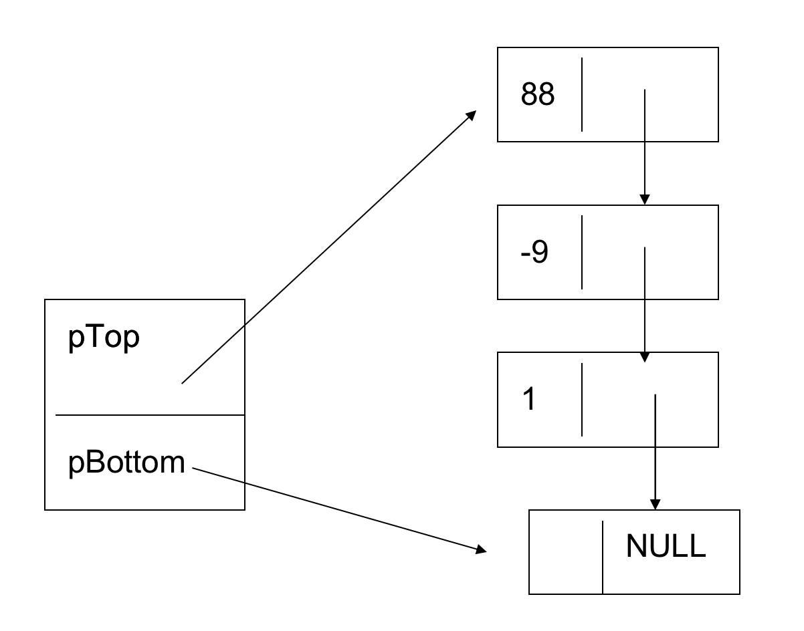

# 栈

在数据结构中，我们把能实现先进后出的数据结构叫做栈，我们可以使用链表或者顺序表来实现栈，实际上栈也是线性表，是受操作限制的线性表，栈的操作是线性表操作的子集。因此，也可以将线性表的结构作为栈的结构。

> 本节，我们使用顺序表来实现栈，也叫做顺序栈。本节，我们暂且不讨论链栈。

## 一、栈的实现过程

### 1. 栈的结构

我们可以使用一个顺序表表示栈，用一个 pBootom 指针代表栈底位置，用 pTop 指针代表栈顶的位置，初始状态下，栈底和栈顶指向同一个节点。栈的结构如下图所示




### 2. 栈的定义

根据栈的结构，我们需要定义两种结构体来存储栈信息。首先我们定义一个`04-stack.cpp`文件，再定义两种结构体，如下代码

```cpp
#include <stdio.h>
#include <stdlib.h>
#include <malloc.h> // 在mac 中使用 #include <sys/malloc.h>， Linux 中使用 #include <malloc.h>

// 定义节点数据类型
typedef struct Node
{
    // 节点数据域
    int data;
    // 节点指针域
    struct Node *pNext;
} NODE, *PNODE; // PNODE等价于 struct NODE *

typedef struct Stack
{
    // 栈顶指针
    PNODE pTop;
    // 栈底指针
    PNODE pBottom;
} STACK, *PSTACK; // PSTACK 等价于 struct STACK *
```

### 3. 栈的初始化